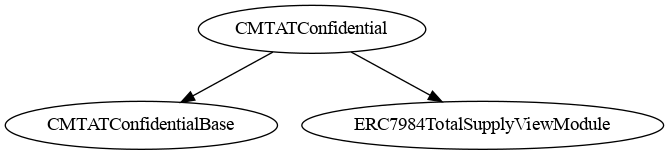
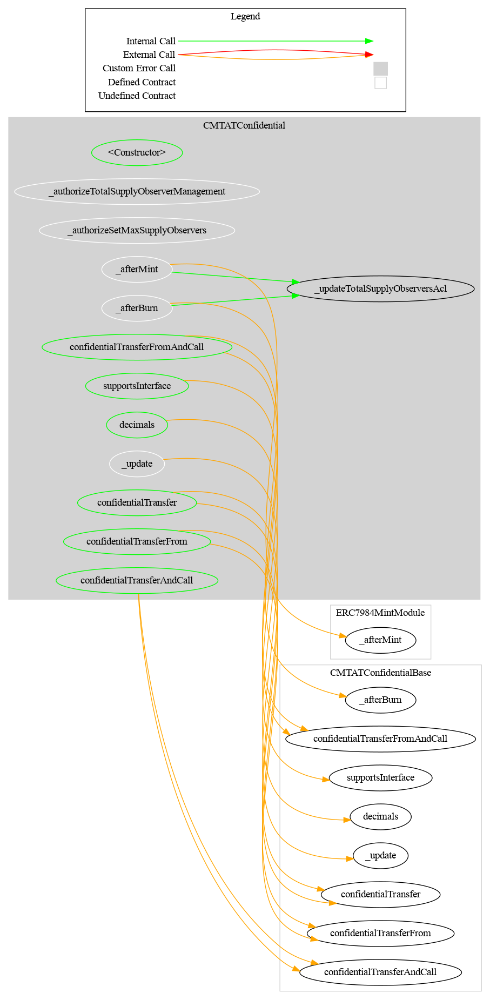

# CMTATConfidential — Technical Reference

## Overview

`CMTATConfidential` is the **full deployment variant** of the CMTAT Confidential token. It extends the shared abstract base (`CMTATConfidentialBase`) with `ERC7984TotalSupplyViewModule`, adding automatic ACL re-grant for registered total supply observers on every mint or burn.

**Source file:** `contracts/deployment/CMTATConfidential.sol`
**Contract version:** `0.3.0` (via `CMTATConfidentialVersionModule`)
**Contract size:** ~21.1 KB

### Schema





---

## Included Modules

### From `CMTATConfidentialBase` (shared by all variants)

| Module | Role gating | Purpose |
|--------|------------|---------|
| `ERC7984` (OZ) | — | Encrypted `euint64` balances, confidential transfers, operator system |
| `CMTATBaseGeneric` (CMTAT) | Multiple | Pause, freeze, access control, document management, token metadata |
| `ZamaEthereumConfig` | — | Hardcodes Zama coprocessor addresses for Ethereum mainnet/Sepolia |
| `ERC7984MintModule` | `MINTER_ROLE` | Mint via encrypted input or existing handle |
| `ERC7984BurnModule` | `BURNER_ROLE` | Burn via encrypted input or existing handle |
| `ERC7984EnforcementModule` | `FORCED_OPS_ROLE` | Forced transfer and forced burn from frozen addresses |
| `ERC7984BalanceViewModule` | `OBSERVER_ROLE` | Dual-slot per-account balance observers (holder + role slot) |
| `ERC7984PublishTotalSupplyModule` | `SUPPLY_PUBLISHER_ROLE` | One-shot public total supply disclosure via `FHE.makePubliclyDecryptable()` |
| `CMTATConfidentialVersionModule` | — | Pins `version()` to `0.3.0` |

### Additional (exclusive to this variant)

| Module | Role gating | Purpose |
|--------|------------|---------|
| `ERC7984TotalSupplyViewModule` | `SUPPLY_OBSERVER_ROLE` | Maintains a registered observer list; re-grants ACL on every mint/burn |

---

## Inheritance Chain

```
CMTATConfidential
├── CMTATConfidentialBase
│   ├── ERC7984                          (OZ Confidential — euint64 balances)
│   ├── CMTATBaseGeneric                 (CMTAT compliance modules)
│   ├── ZamaEthereumConfig               (coprocessor addresses)
│   ├── ERC7984MintModule
│   ├── ERC7984BurnModule
│   ├── ERC7984EnforcementModule
│   ├── ERC7984BalanceViewModule
│   │   └── ERC7984ObserverAccess        (holder observer slot)
│   ├── ERC7984PublishTotalSupplyModule
│   └── CMTATConfidentialVersionModule
└── ERC7984TotalSupplyViewModule         (← added by this variant)
```

> **Diamond resolution:** `CMTATConfidential` re-declares all eight `ERC7984` transfer functions and `supportsInterface`/`decimals` as thin delegates to `CMTATConfidentialBase`, because `ERC7984TotalSupplyViewModule` also inherits from `ERC7984` and creates a conflict the Solidity compiler requires to be explicitly resolved.

---

## Diagrams

### Inheritance


### Call Graph


---

## Roles

| Role | Granted by | Capabilities |
|------|-----------|-------------|
| `DEFAULT_ADMIN_ROLE` | Admin at deploy | Grant/revoke all roles, deactivate contract, set `maxSupplyObservers` |
| `MINTER_ROLE` | `DEFAULT_ADMIN_ROLE` | Call `mint()` |
| `BURNER_ROLE` | `DEFAULT_ADMIN_ROLE` | Call `burn()` |
| `PAUSER_ROLE` | `DEFAULT_ADMIN_ROLE` | Call `pause()` / `unpause()` |
| `ENFORCER_ROLE` | `DEFAULT_ADMIN_ROLE` | Call `setAddressFrozen()` |
| `FORCED_OPS_ROLE` | `DEFAULT_ADMIN_ROLE` | Call `forcedTransfer()` / `forcedBurn()` |
| `OBSERVER_ROLE` | `DEFAULT_ADMIN_ROLE` | Call `setRoleObserver()` / `removeRoleObserver()` |
| `SUPPLY_PUBLISHER_ROLE` | `DEFAULT_ADMIN_ROLE` | Call `publishTotalSupply()` |
| `SUPPLY_OBSERVER_ROLE` | `DEFAULT_ADMIN_ROLE` | Call `addTotalSupplyObserver()` / `removeTotalSupplyObserver()` |

---

## Events

| Event | Source | Emitted by |
|-------|--------|-----------|
| `Mint(minter, to, encryptedAmount)` | `ERC7984MintModule` | `mint()` |
| `Burn(burner, from, encryptedAmount)` | `ERC7984BurnModule` | `burn()` |
| `ForcedTransfer(enforcer, from, to, encryptedAmount)` | `ERC7984EnforcementModule` | `forcedTransfer()` |
| `ForcedBurn(enforcer, from, encryptedAmount)` | `ERC7984EnforcementModule` | `forcedBurn()` |
| `RoleObserverSet(account, oldObserver, newObserver, setBy)` | `ERC7984BalanceViewModule` | `setRoleObserver()`, `removeRoleObserver()` |
| `ERC7984ObserverAccessObserverSet(account, oldObserver, newObserver)` | `ERC7984ObserverAccess` | `setObserver()` |
| `TotalSupplyPublished(publishedBy)` | `ERC7984PublishTotalSupplyModule` | `publishTotalSupply()` |
| `TotalSupplyObserverAdded(observer, addedBy)` | `ERC7984TotalSupplyViewModule` | `addTotalSupplyObserver()` |
| `TotalSupplyObserverRemoved(observer, removedBy)` | `ERC7984TotalSupplyViewModule` | `removeTotalSupplyObserver()` |
| `MaxSupplyObserversUpdated(oldMax, newMax, updatedBy)` | `ERC7984TotalSupplyViewModule` | `setMaxSupplyObservers()` |
| `Paused(account)` | OpenZeppelin `Pausable` | `pause()` |
| `Unpaused(account)` | OpenZeppelin `Pausable` | `unpause()` |
| `Deactivated(account)` | CMTAT | `deactivateContract()` |
| `AddressFrozen(account, isFrozen, enforcer, data)` | CMTAT | `setAddressFrozen()` |
| `RoleGranted/RoleRevoked/RoleAdminChanged` | OZ `AccessControl` | Role management |

---

## Constructor

```solidity
constructor(
    string memory name_,
    string memory symbol_,
    string memory contractUri_,
    uint8 decimals_,          // 0–18; reverts with CMTAT_DecimalsTooHigh above 18
    address admin,            // receives DEFAULT_ADMIN_ROLE
    ICMTATConstructor.ExtraInformationAttributes memory extraInformationAttributes_
)
```

---

## Transfer Validation Flow

All eight transfer variants go through the same gate before any FHE arithmetic:

```
confidentialTransfer / confidentialTransferFrom / *AndCall
    │
    ├─ _canTransferGenericByModule(spender, from, to)
    │      ├─ _canTransferStandardByModule → freeze check (sender, receiver, spender)
    │      └─ pause check
    │  → reverts ERC7943CannotTransfer(from, to, 0) if false
    │
    ├─ _beforeTransfer(spender, from, to)   ← empty in this variant
    │
    └─ ERC7984 FHE arithmetic
```

Mint and burn have their own gates (`_validateMint`, `_validateBurn`) that go through `_canMintBurnByModule`, checking freeze of the recipient/sender and contract deactivation state.

Forced operations (`forcedTransfer`, `forcedBurn`) bypass the standard transfer gate and instead verify:
1. `from` must be frozen (`CMTAT_AddressNotFrozen` otherwise)
2. `to` must not be `address(0)` for forced transfer

---

## Total Supply Visibility

This variant provides two mechanisms:

### Option 1 — Observer list (automatic, stays current)

```solidity
// Add observer — auto-receives ACL after every mint/burn (capped at maxSupplyObservers, default 10)
addTotalSupplyObserver(observer)   // SUPPLY_OBSERVER_ROLE
removeTotalSupplyObserver(observer) // SUPPLY_OBSERVER_ROLE
setMaxSupplyObservers(newMax)      // DEFAULT_ADMIN_ROLE
```

After every mint or burn, `_afterMint` / `_afterBurn` hooks call `_updateTotalSupplyObserversAcl()`, which iterates over all registered observers and calls `FHE.allow()` on the new supply handle.

**Gas note:** One `FHE.allow()` call per observer per mint/burn. Default cap is 10 observers. Keep the list small.

### Option 2 — One-shot public disclosure

```solidity
publishTotalSupply()  // SUPPLY_PUBLISHER_ROLE
```

Marks the **current** handle as publicly decryptable. After the next mint or burn the handle changes — call again if needed. Reverts if no mint or burn has occurred yet.

---

## Key Differences from Other Variants

| Feature | `CMTATConfidential` | `CMTATConfidentialLite` | `CMTATConfidentialRuleEngine` | `CMTATConfidentialWhitelist` |
|---------|:---:|:---:|:---:|:---:|
| Total supply observer list (auto ACL) | ✅ | ❌ | ✅ | ✅ |
| `publishTotalSupply` | ✅ | ✅ | ✅ | ✅ |
| RuleEngine transfer restriction | ❌ | ❌ | ✅ | ❌ |
| Allowlist enforcement (ERC-7943) | ❌ | ❌ | ❌ | ✅ |
| `SUPPLY_OBSERVER_ROLE` | ✅ | ❌ | ✅ | ✅ |
| `RULE_ENGINE_ROLE` | ❌ | ❌ | ✅ | ❌ |
| `ALLOWLIST_ROLE` | ❌ | ❌ | ❌ | ✅ |
| Contract size | ~21.1 KB | ~19.7 KB | ~22.2 KB | ~22.2 KB |

**Choose this variant when:**
- You need automatic ACL re-grant for regulators or auditors watching the total supply, without calling `publishTotalSupply` after every mint/burn.
- You do not need RuleEngine-based transfer policies or an allowlist.
- The gas overhead of iterating the supply observer list on every mint/burn is acceptable for your use case.

**Choose `CMTATConfidentialLite` instead if** you do not need automatic total supply ACL re-grant and want to minimize deployment cost and per-operation gas.

---

## Security Notes

- **`address(0)` freeze warning:** `ENFORCER_ROLE` must never freeze `address(0)`. Direct holder transfers use `address(0)` as a synthetic spender; freezing it blocks all holder-initiated transfers. See [`CMTAT#372`](https://github.com/CMTA/CMTAT/issues/372).
- **`FHE.allow()` is permanent:** Once ACL is granted to an observer it cannot be revoked. Removing an observer stops future grants but does not revoke access to already-granted handles.
- **Observer cap:** `setMaxSupplyObservers` is capped per admin configuration (default 10). Setting it very high risks OOG on mint/burn.
- **`confidentialTransferAndCall` non-atomic refund:** The receiver's callback fires after tokens are credited. If it returns `false`, the contract attempts a best-effort reverse transfer — not an EVM revert. Only call this with audited receiver contracts.
