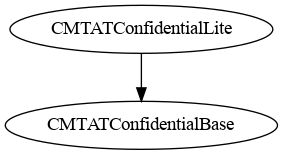
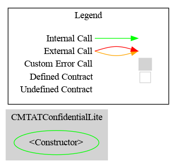

# CMTATConfidentialLite — Technical Reference

## Overview

`CMTATConfidentialLite` is the **lightweight deployment variant** of the CMTAT Confidential token. It is identical to `CMTATConfidential` but omits `ERC7984TotalSupplyViewModule`, meaning there is no registered observer list that receives automatic ACL re-grant on mint/burn. This reduces contract size by ~1.3 KB and eliminates the per-observer `FHE.allow()` loop on every mint and burn.

`publishTotalSupply` (one-shot public disclosure) is still available from `ERC7984PublishTotalSupplyModule`, which is part of the shared base.

**Source file:** `contracts/CMTATConfidentialLite.sol`
**Contract version:** `0.3.0` (via `CMTATConfidentialVersionModule`)
**Contract size:** ~19.2 KB



---

## Included Modules

All modules are inherited from `CMTATConfidentialBase`:

| Module | Role gating | Purpose |
|--------|------------|---------|
| `ERC7984` (OZ) | — | Encrypted `euint64` balances, confidential transfers, operator system |
| `CMTATBaseGeneric` (CMTAT) | Multiple | Pause, freeze, access control, document management, token metadata |
| `ZamaEthereumConfig` | — | Hardcodes Zama coprocessor addresses for Ethereum mainnet/Sepolia |
| `ERC7984MintModule` | `MINTER_ROLE` | Mint via encrypted input or existing handle |
| `ERC7984BurnModule` | `BURNER_ROLE` | Burn via encrypted input or existing handle |
| `ERC7984EnforcementModule` | `FORCED_OPS_ROLE` | Forced transfer and forced burn from frozen addresses |
| `ERC7984BalanceViewModule` | `OBSERVER_ROLE` | Dual-slot per-account balance observers (holder + role slot) |
| `ERC7984PublishTotalSupplyModule` | `SUPPLY_PUBLISHER_ROLE` | One-shot public total supply disclosure via `FHE.makePubliclyDecryptable()` |
| `CMTATConfidentialVersionModule` | — | Pins `version()` to `0.3.0` |

`ERC7984TotalSupplyViewModule` is **not** included — this is the only structural difference from `CMTATConfidential`.

---

## Inheritance Chain

```
CMTATConfidentialLite
└── CMTATConfidentialBase
    ├── ERC7984                          (OZ Confidential — euint64 balances)
    ├── CMTATBaseGeneric                 (CMTAT compliance modules)
    ├── ZamaEthereumConfig               (coprocessor addresses)
    ├── ERC7984MintModule
    ├── ERC7984BurnModule
    ├── ERC7984EnforcementModule
    ├── ERC7984BalanceViewModule
    │   └── ERC7984ObserverAccess        (holder observer slot)
    ├── ERC7984PublishTotalSupplyModule
    └── CMTATConfidentialVersionModule
```

> **No diamond resolution needed:** Unlike `CMTATConfidential`, this variant only inherits from `CMTATConfidentialBase` — there is no second `ERC7984` descendant, so no transfer function re-declarations are required.

---

## Diagrams

### Inheritance


### Call Graph



---

## Roles

| Role | Granted by | Capabilities |
|------|-----------|-------------|
| `DEFAULT_ADMIN_ROLE` | Admin at deploy | Grant/revoke all roles, deactivate contract |
| `MINTER_ROLE` | `DEFAULT_ADMIN_ROLE` | Call `mint()` |
| `BURNER_ROLE` | `DEFAULT_ADMIN_ROLE` | Call `burn()` |
| `PAUSER_ROLE` | `DEFAULT_ADMIN_ROLE` | Call `pause()` / `unpause()` |
| `ENFORCER_ROLE` | `DEFAULT_ADMIN_ROLE` | Call `setAddressFrozen()` |
| `FORCED_OPS_ROLE` | `DEFAULT_ADMIN_ROLE` | Call `forcedTransfer()` / `forcedBurn()` |
| `OBSERVER_ROLE` | `DEFAULT_ADMIN_ROLE` | Call `setRoleObserver()` / `removeRoleObserver()` |
| `SUPPLY_PUBLISHER_ROLE` | `DEFAULT_ADMIN_ROLE` | Call `publishTotalSupply()` |

> **`SUPPLY_OBSERVER_ROLE` is not present.** Because there is no total supply observer list, neither the role nor the functions `addTotalSupplyObserver` / `removeTotalSupplyObserver` / `setMaxSupplyObservers` exist on this contract.

---

## Events

| Event | Source | Emitted by |
|-------|--------|-----------|
| `Mint(minter, to, encryptedAmount)` | `ERC7984MintModule` | `mint()` |
| `Burn(burner, from, encryptedAmount)` | `ERC7984BurnModule` | `burn()` |
| `ForcedTransfer(enforcer, from, to, encryptedAmount)` | `ERC7984EnforcementModule` | `forcedTransfer()` |
| `ForcedBurn(enforcer, from, encryptedAmount)` | `ERC7984EnforcementModule` | `forcedBurn()` |
| `RoleObserverSet(account, oldObserver, newObserver, setBy)` | `ERC7984BalanceViewModule` | `setRoleObserver()`, `removeRoleObserver()` |
| `ERC7984ObserverAccessObserverSet(account, oldObserver, newObserver)` | `ERC7984ObserverAccess` | `setObserver()` |
| `TotalSupplyPublished(publishedBy)` | `ERC7984PublishTotalSupplyModule` | `publishTotalSupply()` |
| `Paused(account)` | OpenZeppelin `Pausable` | `pause()` |
| `Unpaused(account)` | OpenZeppelin `Pausable` | `unpause()` |
| `Deactivated(account)` | CMTAT | `deactivateContract()` |
| `AddressFrozen(account, isFrozen, enforcer, data)` | CMTAT | `setAddressFrozen()` |
| `RoleGranted/RoleRevoked/RoleAdminChanged` | OZ `AccessControl` | Role management |

`TotalSupplyObserverAdded`, `TotalSupplyObserverRemoved`, and `MaxSupplyObserversUpdated` are **not emitted** — those belong to `ERC7984TotalSupplyViewModule`, which is absent.

---

## Constructor

```solidity
constructor(
    string memory name_,
    string memory symbol_,
    string memory contractUri_,
    uint8 decimals_,          // 0–18; reverts with CMTAT_DecimalsTooHigh above 18
    address admin,            // receives DEFAULT_ADMIN_ROLE
    ICMTATConstructor.ExtraInformationAttributes memory extraInformationAttributes_
)
```

---

## Transfer Validation Flow

Identical to `CMTATConfidential` — all eight transfer variants go through the same gate:

```
confidentialTransfer / confidentialTransferFrom / *AndCall
    │
    ├─ _canTransferGenericByModule(spender, from, to)
    │      ├─ _canTransferStandardByModule → freeze check (sender, receiver, spender)
    │      └─ pause check
    │  → reverts ERC7943CannotTransfer(from, to, 0) if false
    │
    ├─ _beforeTransfer(spender, from, to)   ← empty in this variant
    │
    └─ ERC7984 FHE arithmetic
```

---

## Total Supply Visibility

Only **Option 2 — one-shot public disclosure** is available:

```solidity
publishTotalSupply()  // SUPPLY_PUBLISHER_ROLE
```

Marks the **current** handle as publicly decryptable. After the next mint or burn the handle changes — call again if needed.

For automatic ACL re-grant to a fixed list of regulators or auditors, deploy `CMTATConfidential` instead.

---

## Key Differences from Other Variants

| Feature | `CMTATConfidential` | `CMTATConfidentialLite` | `CMTATConfidentialRuleEngine` | `CMTATConfidentialWhitelist` |
|---------|:---:|:---:|:---:|:---:|
| Total supply observer list (auto ACL) | ✅ | ❌ | ✅ | ✅ |
| `publishTotalSupply` | ✅ | ✅ | ✅ | ✅ |
| RuleEngine transfer restriction | ❌ | ❌ | ✅ | ❌ |
| Allowlist enforcement (ERC-7943) | ❌ | ❌ | ❌ | ✅ |
| `SUPPLY_OBSERVER_ROLE` | ✅ | ❌ | ✅ | ✅ |
| `RULE_ENGINE_ROLE` | ❌ | ❌ | ✅ | ❌ |
| `ALLOWLIST_ROLE` | ❌ | ❌ | ❌ | ✅ |
| Contract size | ~20.7 KB | ~19.2 KB | ~21.9 KB | ~21.9 KB |

**Choose this variant when:**
- You do not need an on-chain observer list that automatically receives total supply ACL after every mint/burn.
- You want to minimize deployment cost (~1.3 KB smaller than `CMTATConfidential`) and eliminate the per-observer `FHE.allow()` gas overhead on every mint/burn.
- You are comfortable calling `publishTotalSupply()` manually whenever a compliance party needs to read the supply.

**Choose `CMTATConfidential` instead if** total supply observers need to stay current automatically without manual intervention after every mint/burn.

---

## Security Notes

- **`address(0)` freeze warning:** `ENFORCER_ROLE` must never freeze `address(0)`. See [`CMTAT#372`](https://github.com/CMTA/CMTAT/issues/372).
- **`FHE.allow()` is permanent:** ACL access granted through balance observers cannot be revoked.
- **`confidentialTransferAndCall` non-atomic refund:** The receiver callback fires after tokens are credited. If it returns `false`, a best-effort reverse transfer is attempted — not an EVM revert. Only call this with audited receiver contracts.
