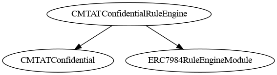
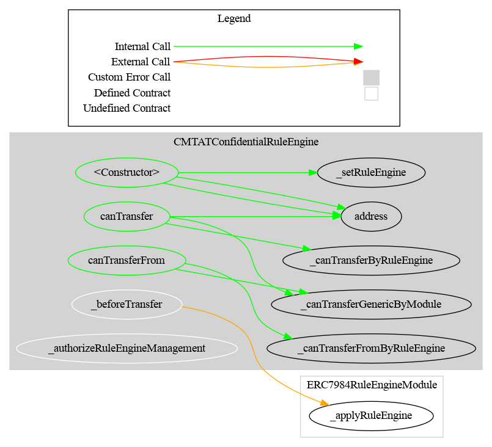

# CMTATConfidentialRuleEngine — Technical Reference

## Overview

`CMTATConfidentialRuleEngine` is a deployment variant that adds CMTA **RuleEngine** integration to the full `CMTATConfidential` feature set. A RuleEngine is an external contract that evaluates transfer policies (allowlists, blacklists, jurisdiction checks, investor categorization, etc.) and can block transfers by reverting.

Because transfer amounts are encrypted (`euint64`), the RuleEngine always receives `value = 0` — only the public sender and receiver addresses are available for policy evaluation.

**Source file:** `contracts/CMTATConfidentialRuleEngine.sol`
**Contract version:** `0.3.0` (via `CMTATConfidentialVersionModule`)
**Contract size:** ~21.9 KB

### Schema





---


## Included Modules

### From `CMTATConfidential` (via `CMTATConfidentialBase`)

| Module | Role gating | Purpose |
|--------|------------|---------|
| `ERC7984` (OZ) | — | Encrypted `euint64` balances, confidential transfers, operator system |
| `CMTATBaseGeneric` (CMTAT) | Multiple | Pause, freeze, access control, document management, token metadata |
| `ZamaEthereumConfig` | — | Hardcodes Zama coprocessor addresses for Ethereum mainnet/Sepolia |
| `ERC7984MintModule` | `MINTER_ROLE` | Mint via encrypted input or existing handle |
| `ERC7984BurnModule` | `BURNER_ROLE` | Burn via encrypted input or existing handle |
| `ERC7984EnforcementModule` | `FORCED_OPS_ROLE` | Forced transfer and forced burn from frozen addresses |
| `ERC7984BalanceViewModule` | `OBSERVER_ROLE` | Dual-slot per-account balance observers (holder + role slot) |
| `ERC7984PublishTotalSupplyModule` | `SUPPLY_PUBLISHER_ROLE` | One-shot public total supply disclosure |
| `ERC7984TotalSupplyViewModule` | `SUPPLY_OBSERVER_ROLE` | Automatic ACL re-grant on every mint/burn for registered observers |
| `CMTATConfidentialVersionModule` | — | Pins `version()` to `0.3.0` |

### Additional (exclusive to this variant)

| Module | Role gating | Purpose |
|--------|------------|---------|
| `ERC7984RuleEngineModule` | `RULE_ENGINE_ROLE` | RuleEngine storage (`setRuleEngine`), pre-transfer checks (`canTransfer`), pre-FHE notification (`_applyRuleEngine`) |

---

## Inheritance Chain

```
CMTATConfidentialRuleEngine
├── CMTATConfidential
│   ├── CMTATConfidentialBase
│   │   ├── ERC7984
│   │   ├── CMTATBaseGeneric
│   │   ├── ZamaEthereumConfig
│   │   ├── ERC7984MintModule
│   │   ├── ERC7984BurnModule
│   │   ├── ERC7984EnforcementModule
│   │   ├── ERC7984BalanceViewModule
│   │   │   └── ERC7984ObserverAccess
│   │   ├── ERC7984PublishTotalSupplyModule
│   │   └── CMTATConfidentialVersionModule
│   └── ERC7984TotalSupplyViewModule
└── ERC7984RuleEngineModule
    └── ValidationModuleRuleEngineInternal  (CMTAT — ruleEngine storage + RuleEngine event)
```

---

## Diagrams

### Inheritance


### Call Graph



---

## Roles

| Role | Granted by | Capabilities |
|------|-----------|-------------|
| `DEFAULT_ADMIN_ROLE` | Admin at deploy | Grant/revoke all roles, deactivate contract, set `maxSupplyObservers` |
| `MINTER_ROLE` | `DEFAULT_ADMIN_ROLE` | Call `mint()` |
| `BURNER_ROLE` | `DEFAULT_ADMIN_ROLE` | Call `burn()` |
| `PAUSER_ROLE` | `DEFAULT_ADMIN_ROLE` | Call `pause()` / `unpause()` |
| `ENFORCER_ROLE` | `DEFAULT_ADMIN_ROLE` | Call `setAddressFrozen()` |
| `FORCED_OPS_ROLE` | `DEFAULT_ADMIN_ROLE` | Call `forcedTransfer()` / `forcedBurn()` |
| `OBSERVER_ROLE` | `DEFAULT_ADMIN_ROLE` | Call `setRoleObserver()` / `removeRoleObserver()` |
| `SUPPLY_PUBLISHER_ROLE` | `DEFAULT_ADMIN_ROLE` | Call `publishTotalSupply()` |
| `SUPPLY_OBSERVER_ROLE` | `DEFAULT_ADMIN_ROLE` | Call `addTotalSupplyObserver()` / `removeTotalSupplyObserver()` |
| `RULE_ENGINE_ROLE` | `DEFAULT_ADMIN_ROLE` | Call `setRuleEngine()` |

---

## Events

| Event | Source | Emitted by |
|-------|--------|-----------|
| `Mint(minter, to, encryptedAmount)` | `ERC7984MintModule` | `mint()` |
| `Burn(burner, from, encryptedAmount)` | `ERC7984BurnModule` | `burn()` |
| `ForcedTransfer(enforcer, from, to, encryptedAmount)` | `ERC7984EnforcementModule` | `forcedTransfer()` |
| `ForcedBurn(enforcer, from, encryptedAmount)` | `ERC7984EnforcementModule` | `forcedBurn()` |
| `RoleObserverSet(account, oldObserver, newObserver, setBy)` | `ERC7984BalanceViewModule` | `setRoleObserver()`, `removeRoleObserver()` |
| `ERC7984ObserverAccessObserverSet(account, oldObserver, newObserver)` | `ERC7984ObserverAccess` | `setObserver()` |
| `TotalSupplyPublished(publishedBy)` | `ERC7984PublishTotalSupplyModule` | `publishTotalSupply()` |
| `TotalSupplyObserverAdded(observer, addedBy)` | `ERC7984TotalSupplyViewModule` | `addTotalSupplyObserver()` |
| `TotalSupplyObserverRemoved(observer, removedBy)` | `ERC7984TotalSupplyViewModule` | `removeTotalSupplyObserver()` |
| `MaxSupplyObserversUpdated(oldMax, newMax, updatedBy)` | `ERC7984TotalSupplyViewModule` | `setMaxSupplyObservers()` |
| `RuleEngine(indexed newRuleEngine)` | `ValidationModuleRuleEngineInternal` | `setRuleEngine()` |
| `Paused(account)` | OpenZeppelin `Pausable` | `pause()` |
| `Unpaused(account)` | OpenZeppelin `Pausable` | `unpause()` |
| `Deactivated(account)` | CMTAT | `deactivateContract()` |
| `AddressFrozen(account, isFrozen, enforcer, data)` | CMTAT | `setAddressFrozen()` |
| `RoleGranted/RoleRevoked/RoleAdminChanged` | OZ `AccessControl` | Role management |

---

## Constructor

```solidity
constructor(
    string memory name_,
    string memory symbol_,
    string memory contractUri_,
    uint8 decimals_,          // 0–18; reverts with CMTAT_DecimalsTooHigh above 18
    address admin,            // receives DEFAULT_ADMIN_ROLE
    ICMTATConstructor.ExtraInformationAttributes memory extraInformationAttributes_,
    IRuleEngine ruleEngine_   // address(0) to deploy without an engine; set later via setRuleEngine
)
```

---

## Transfer Validation Flow

The RuleEngine adds two checks on top of the base transfer gate:

```
confidentialTransfer / confidentialTransferFrom / *AndCall
    │
    ├─ _canTransferGenericByModule(spender, from, to)
    │      ├─ _canTransferStandardByModule → freeze check (sender, receiver, spender)
    │      └─ pause check
    │  → reverts ERC7943CannotTransfer(from, to, 0) if false
    │
    ├─ _beforeTransfer(spender, from, to)
    │      └─ ERC7984RuleEngineModule._applyRuleEngine(spender, from, to)
    │             ├─ ruleEngine.transferred(spender, from, to, 0)   [operator transfer]
    │             └─ ruleEngine.transferred(from, to, 0)            [direct transfer]
    │         → reverts if ruleEngine reverts
    │
    └─ ERC7984 FHE arithmetic
```

The RuleEngine notification fires **before** FHE arithmetic. This mirrors CMTAT's ordering and avoids wasting FHE gas if the engine rejects the transfer.

Mint and burn do **not** call the RuleEngine — only holder and operator transfers go through it. Forced operations also bypass the RuleEngine.

---

## RuleEngine View Functions

```solidity
// Current rule engine (address(0) if none)
function ruleEngine() public view returns (IRuleEngine);

// Check whether a direct transfer is currently permitted (CMTAT rule engine + module gates)
function canTransfer(address from, address to, uint256 /*amount*/) public view returns (bool);

// Check whether an operator transfer is currently permitted
function canTransferFrom(address spender, address from, address to, uint256 /*amount*/) public view returns (bool);
```

Both `canTransfer` and `canTransferFrom` pass `0` as the RuleEngine `value`. Amount-based rules in the engine (minimum transfer size, balance caps) are not reflected by these views.

---

## RuleEngine Value Convention

| Call site | CMTAT standard | This contract |
|-----------|---------------|--------------|
| `ruleEngine.canTransfer(from, to, value)` | plaintext amount | `0` |
| `ruleEngine.canTransferFrom(spender, from, to, value)` | plaintext amount | `0` |
| `ruleEngine.transferred(from, to, value)` | plaintext amount | `0` |
| `ruleEngine.transferred(spender, from, to, value)` | plaintext amount | `0` |

The amount is structurally zero because the actual transfer amount is encrypted and not available at the Solidity call boundary.

---

## Key Differences from Other Variants

| Feature | `CMTATConfidential` | `CMTATConfidentialLite` | `CMTATConfidentialRuleEngine` | `CMTATConfidentialWhitelist` |
|---------|:---:|:---:|:---:|:---:|
| Total supply observer list (auto ACL) | ✅ | ❌ | ✅ | ✅ |
| `publishTotalSupply` | ✅ | ✅ | ✅ | ✅ |
| RuleEngine transfer restriction | ❌ | ❌ | ✅ | ❌ |
| Allowlist enforcement (ERC-7943) | ❌ | ❌ | ❌ | ✅ |
| `SUPPLY_OBSERVER_ROLE` | ✅ | ❌ | ✅ | ✅ |
| `RULE_ENGINE_ROLE` | ❌ | ❌ | ✅ | ❌ |
| `ALLOWLIST_ROLE` | ❌ | ❌ | ❌ | ✅ |
| Contract size | ~20.7 KB | ~19.2 KB | ~21.9 KB | ~21.9 KB |

**Choose this variant when:**
- Transfer policy is complex and must be managed externally (e.g., allowlists, blacklists, jurisdiction rules, investor categorization) through a CMTA-compatible RuleEngine contract.
- The RuleEngine needs to be swappable without redeploying the token.
- You need both RuleEngine restrictions and the total supply observer list.

**Choose `CMTATConfidentialWhitelist` instead if** the policy is a simple on/off allowlist and you do not need an external, swappable rule engine.

**Choose `CMTATConfidential` instead if** no transfer policy is required beyond freeze and pause.

---

## Security Notes

- **`value = 0` limitation:** RuleEngine rules that depend on the transferred amount (minimum size, balance caps, proportional checks) will not evaluate correctly since the amount is always `0`. Only address-based and state-based rules are effective.
- **RuleEngine reverting blocks all transfers:** If the RuleEngine itself reverts (e.g., due to a bug or upgrade), all holder and operator transfers are blocked. The `RULE_ENGINE_ROLE` holder can call `setRuleEngine(address(0))` to disable checks, provided a non-zero engine was previously set — calling it when the current engine is already `address(0)` reverts with `ERC7984RuleEngineModule_SameRuleEngine`.
- **`address(0)` freeze warning:** Same as all variants — never freeze `address(0)`. See [`CMTAT#372`](https://github.com/CMTA/CMTAT/issues/372).
- **`FHE.allow()` is permanent:** ACL access granted through observers cannot be revoked.
