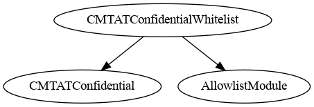
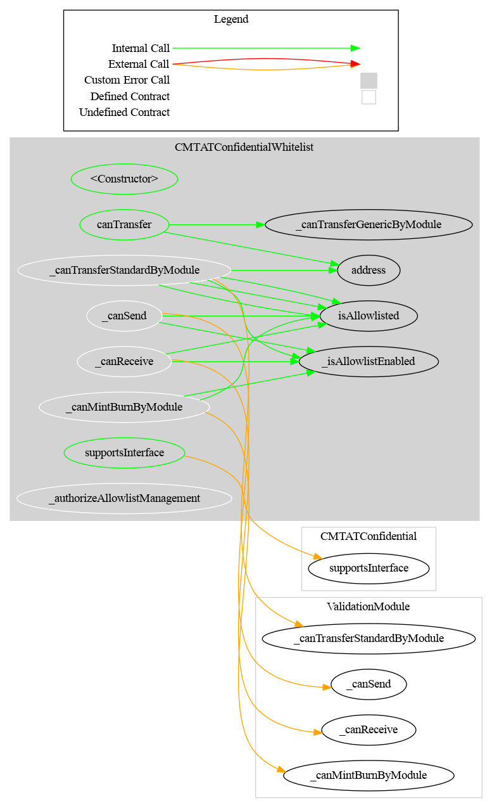

# CMTATConfidentialWhitelist — Technical Reference

## Overview

`CMTATConfidentialWhitelist` is a deployment variant that adds an **on/off allowlist** (whitelist) to the full `CMTATConfidential` feature set. When allowlist enforcement is enabled, every confidential transfer, mint, and burn is validated against a simple address-level allowlist. The contract implements the [ERC-7943](../ERCSpecification/erc-7943-uRWA.md) fungible interface (`canSend`, `canReceive`, `canTransfer`) and advertises it via ERC-165.

Forced operations (`forcedTransfer`, `forcedBurn`) intentionally bypass the allowlist — they enforce only the frozen-address precondition. This mirrors CMTAT's design intent where regulatory enforcement powers (court orders, sanctions, error correction) override operational restrictions.

**Source file:** `contracts/CMTATConfidentialWhitelist.sol`
**Contract version:** `0.3.0` (via `CMTATConfidentialVersionModule`)
**Contract size:** ~22.2 KB




---

## Included Modules

### From `CMTATConfidential` (via `CMTATConfidentialBase`)

| Module | Role gating | Purpose |
|--------|------------|---------|
| `ERC7984` (OZ) | — | Encrypted `euint64` balances, confidential transfers, operator system |
| `CMTATBaseGeneric` (CMTAT) | Multiple | Pause, freeze, access control, document management, token metadata |
| `ZamaEthereumConfig` | — | Hardcodes Zama coprocessor addresses for Ethereum mainnet/Sepolia |
| `ERC7984MintModule` | `MINTER_ROLE` | Mint via encrypted input or existing handle |
| `ERC7984BurnModule` | `BURNER_ROLE` | Burn via encrypted input or existing handle |
| `ERC7984EnforcementModule` | `FORCED_OPS_ROLE` | Forced transfer and forced burn from frozen addresses |
| `ERC7984BalanceViewModule` | `OBSERVER_ROLE` | Dual-slot per-account balance observers (holder + role slot) |
| `ERC7984PublishTotalSupplyModule` | `SUPPLY_PUBLISHER_ROLE` | One-shot public total supply disclosure |
| `ERC7984TotalSupplyViewModule` | `SUPPLY_OBSERVER_ROLE` | Automatic ACL re-grant on every mint/burn for registered observers |
| `CMTATConfidentialVersionModule` | — | Pins `version()` to `0.3.0` |

### Additional (exclusive to this variant)

| Module | Role gating | Purpose |
|--------|------------|---------|
| `AllowlistModule` (CMTAT) | `ALLOWLIST_ROLE` | On-chain allowlist storage, `isAllowlisted()`, `setAddressAllowlist()`, `enableAllowlist()` |

---

## Inheritance Chain

```
CMTATConfidentialWhitelist
├── CMTATConfidential
│   ├── CMTATConfidentialBase
│   │   ├── ERC7984
│   │   ├── CMTATBaseGeneric
│   │   ├── ZamaEthereumConfig
│   │   ├── ERC7984MintModule
│   │   ├── ERC7984BurnModule
│   │   ├── ERC7984EnforcementModule
│   │   ├── ERC7984BalanceViewModule
│   │   │   └── ERC7984ObserverAccess
│   │   ├── ERC7984PublishTotalSupplyModule
│   │   └── CMTATConfidentialVersionModule
│   └── ERC7984TotalSupplyViewModule
└── AllowlistModule (CMTAT)
```

---

## Diagrams

### Inheritance


### Call Graph



---

## Roles

| Role | Granted by | Capabilities |
|------|-----------|-------------|
| `DEFAULT_ADMIN_ROLE` | Admin at deploy | Grant/revoke all roles, deactivate contract, set `maxSupplyObservers` |
| `MINTER_ROLE` | `DEFAULT_ADMIN_ROLE` | Call `mint()` |
| `BURNER_ROLE` | `DEFAULT_ADMIN_ROLE` | Call `burn()` |
| `PAUSER_ROLE` | `DEFAULT_ADMIN_ROLE` | Call `pause()` / `unpause()` |
| `ENFORCER_ROLE` | `DEFAULT_ADMIN_ROLE` | Call `setAddressFrozen()` |
| `FORCED_OPS_ROLE` | `DEFAULT_ADMIN_ROLE` | Call `forcedTransfer()` / `forcedBurn()` |
| `OBSERVER_ROLE` | `DEFAULT_ADMIN_ROLE` | Call `setRoleObserver()` / `removeRoleObserver()` |
| `SUPPLY_PUBLISHER_ROLE` | `DEFAULT_ADMIN_ROLE` | Call `publishTotalSupply()` |
| `SUPPLY_OBSERVER_ROLE` | `DEFAULT_ADMIN_ROLE` | Call `addTotalSupplyObserver()` / `removeTotalSupplyObserver()` |
| `ALLOWLIST_ROLE` | `DEFAULT_ADMIN_ROLE` | Call `setAddressAllowlist()` / `enableAllowlist()` |

---

## Events

| Event | Source | Emitted by |
|-------|--------|-----------|
| `Mint(minter, to, encryptedAmount)` | `ERC7984MintModule` | `mint()` |
| `Burn(burner, from, encryptedAmount)` | `ERC7984BurnModule` | `burn()` |
| `ForcedTransfer(enforcer, from, to, encryptedAmount)` | `ERC7984EnforcementModule` | `forcedTransfer()` |
| `ForcedBurn(enforcer, from, encryptedAmount)` | `ERC7984EnforcementModule` | `forcedBurn()` |
| `RoleObserverSet(account, oldObserver, newObserver, setBy)` | `ERC7984BalanceViewModule` | `setRoleObserver()`, `removeRoleObserver()` |
| `ERC7984ObserverAccessObserverSet(account, oldObserver, newObserver)` | `ERC7984ObserverAccess` | `setObserver()` |
| `TotalSupplyPublished(publishedBy)` | `ERC7984PublishTotalSupplyModule` | `publishTotalSupply()` |
| `TotalSupplyObserverAdded(observer, addedBy)` | `ERC7984TotalSupplyViewModule` | `addTotalSupplyObserver()` |
| `TotalSupplyObserverRemoved(observer, removedBy)` | `ERC7984TotalSupplyViewModule` | `removeTotalSupplyObserver()` |
| `MaxSupplyObserversUpdated(oldMax, newMax, updatedBy)` | `ERC7984TotalSupplyViewModule` | `setMaxSupplyObservers()` |
| `AllowlistEnableStatus(indexed operator, status)` | CMTAT `AllowlistModule` | `enableAllowlist()` |
| `AddressAddedToAllowlist(indexed account, indexed status, indexed enforcer, data)` | CMTAT `AllowlistModule` | `setAddressAllowlist()` |
| `Paused(account)` | OpenZeppelin `Pausable` | `pause()` |
| `Unpaused(account)` | OpenZeppelin `Pausable` | `unpause()` |
| `Deactivated(account)` | CMTAT | `deactivateContract()` |
| `AddressFrozen(account, isFrozen, enforcer, data)` | CMTAT | `setAddressFrozen()` |
| `RoleGranted/RoleRevoked/RoleAdminChanged` | OZ `AccessControl` | Role management |

---

## Constructor

```solidity
constructor(
    string memory name_,
    string memory symbol_,
    string memory contractUri_,
    uint8 decimals_,          // 0–18; reverts with CMTAT_DecimalsTooHigh above 18
    address admin,            // receives DEFAULT_ADMIN_ROLE
    ICMTATConstructor.ExtraInformationAttributes memory extraInformationAttributes_
)
```

---

## Allowlist Management

```solidity
// Enable or disable allowlist enforcement (ALLOWLIST_ROLE)
function enableAllowlist(bool status) public;

// Add or remove a single address (ALLOWLIST_ROLE)
function setAddressAllowlist(address account, bool status) public;

// Batch add or remove addresses (ALLOWLIST_ROLE)
function batchSetAddressAllowlist(address[] calldata accounts, bool[] calldata status) public;

// Read allowlist state
function isAllowlisted(address account) public view returns (bool);
function isAllowlistEnabled() public view returns (bool);
```

When `isAllowlistEnabled() == false`, all allowlist checks are bypassed and the contract behaves identically to `CMTATConfidential`.

---

## Transfer Validation Flow

When the allowlist is enabled, every transfer path checks allowlist membership in addition to the base freeze/pause gate:

```
confidentialTransfer / confidentialTransferFrom / *AndCall
    │
    ├─ _canTransferGenericByModule(spender, from, to)
    │      ├─ _canTransferStandardByModule
    │      │      ├─ allowlist check (sender, receiver, spender)     [whitelist — early return]
    │      │      └─ freeze check (sender, receiver, spender)        [base ValidationModule]
    │      └─ pause check
    │  → reverts ERC7943CannotTransfer(from, to, 0) if false
    │
    ├─ _beforeTransfer(spender, from, to)   ← empty in this variant
    │
    └─ ERC7984 FHE arithmetic
```

**Mint** gate (`_validateMint`) uses `_canMintBurnByModule(to)`:
- Checks `isAllowlisted(to)` when enabled → reverts `ERC7943CannotReceive(to)`

**Burn** gate (`_validateBurn`) uses `_canMintBurnByModule(from)`:
- Checks `isAllowlisted(from)` when enabled → reverts `ERC7943CannotSend(from)`

**Forced operations** (`forcedTransfer`, `forcedBurn`) bypass the allowlist entirely — they only enforce the frozen-address precondition.

---

## ERC-7943 Partial Implementation

CMTAT Confidential implements **part** of `IERC7943Fungible` but **cannot claim full compliance** (`interfaceId = 0x3edbb4c4`) because the FHE architecture is fundamentally incompatible with several mandatory interface members.

### Why full ERC-7943 compliance is not possible

`IERC7943Fungible` mandates plaintext amounts in enforcement and freeze operations:

| ERC-7943 requirement | Reason incompatible |
|---|---|
| `forcedTransfer(address, address, uint256 amount)` | Transfer amounts are encrypted (`euint64`); no plaintext amount exists at the contract level |
| `setFrozenTokens(address, uint256 amount)` | ERC-7943 uses an amount-based freeze model; CMTAT uses a boolean freeze (`setAddressFrozen`) |
| `getFrozenTokens(address) → uint256` | Boolean freeze model; no amount can be returned |
| `ForcedTransfer(from, to, uint256 amount)` event | Emitting a plaintext seized amount would break confidentiality |
| `Frozen(account, uint256 amount)` event | No amount to emit |

### What is implemented

The following ERC-7943 view functions and errors are available in **all four deployment variants** (inherited from CMTAT's `ValidationModule` and `CMTATConfidentialBase`):

```solidity
// Account-level eligibility checks (checks freeze; Whitelist variant also checks allowlist)
function canSend(address account) public view returns (bool);
function canReceive(address account) public view returns (bool);

// Transfer-level authorization check (amount ignored — encrypted and unavailable)
function canTransfer(address from, address to, uint256 /*amount*/) public view returns (bool);
```

Standard ERC-7943 errors are also emitted on revert by all variants:
- `ERC7943CannotSend(address account)` — emitted on mint/burn when target is frozen or not allowlisted
- `ERC7943CannotReceive(address account)` — same, for the recipient side
- `ERC7943CannotTransfer(address from, address to, uint256 amount)` — emitted on blocked transfers (always with `amount = 0` since the actual amount is encrypted)

### Behaviour of the view functions (Whitelist variant)

**Important asymmetry:** `canSend`/`canReceive` check freeze + allowlist only — they do **not** reflect pause state. When the contract is paused, both may return `true` while `canTransfer` returns `false`. Always use `canTransfer` for the authoritative pre-flight check.

**`canTransfer` operator limitation:** `canTransfer(from, to, amount)` internally uses `address(0)` as the spender, so it models a direct holder transfer. It cannot pre-flight an operator (`transferFrom`) call for a specific spender. A non-allowlisted operator will be rejected at execution time even if `canTransfer(from, to, 0)` returns `true`.

| Condition | `canSend(from)` | `canReceive(to)` | `canTransfer(from, to, 0)` |
|-----------|:-:|:-:|:-:|
| Both allowlisted, not frozen, not paused | ✅ | ✅ | ✅ |
| Sender not allowlisted | ❌ | ✅ | ❌ |
| Recipient not allowlisted | ✅ | ❌ | ❌ |
| Sender frozen | ❌ | ✅ | ❌ |
| Contract paused | ✅ | ✅ | ❌ |

### ERC-165 introspection

`supportsInterface` does **not** return `true` for `0x3edbb4c4`. Advertising full `IERC7943Fungible` compliance would mislead integrators that attempt to call `forcedTransfer(uint256)`, `setFrozenTokens`, or `getFrozenTokens` and expect amount-based semantics.

---

## Key Differences from Other Variants

| Feature | `CMTATConfidential` | `CMTATConfidentialLite` | `CMTATConfidentialRuleEngine` | `CMTATConfidentialWhitelist` |
|---------|:---:|:---:|:---:|:---:|
| Total supply observer list (auto ACL) | ✅ | ❌ | ✅ | ✅ |
| `publishTotalSupply` | ✅ | ✅ | ✅ | ✅ |
| RuleEngine transfer restriction | ❌ | ❌ | ✅ | ❌ |
| Allowlist enforcement | ❌ | ❌ | ❌ | ✅ |
| `canSend` / `canReceive` / `canTransfer` (partial ERC-7943) | ✅ | ✅ | ✅ | ✅ |
| ERC-7943 `0x3edbb4c4` (full compliance) | ❌ | ❌ | ❌ | ❌ |
| `SUPPLY_OBSERVER_ROLE` | ✅ | ❌ | ✅ | ✅ |
| `RULE_ENGINE_ROLE` | ❌ | ❌ | ✅ | ❌ |
| `ALLOWLIST_ROLE` | ❌ | ❌ | ❌ | ✅ |
| Contract size | ~21.1 KB | ~19.7 KB | ~22.2 KB | ~22.2 KB |

**Choose this variant when:**
- Transfer policy is a simple on/off allowlist — both sender and recipient must be approved.
- You need `canSend`/`canReceive`/`canTransfer` view checks for off-chain or UI integration with allowlist-aware semantics.
- The allowlist is managed by your compliance team and is expected to change infrequently.
- You do not need the flexibility of a swappable external RuleEngine.

**Choose `CMTATConfidentialRuleEngine` instead if** the transfer policy is complex, involves multiple rules (jurisdiction, investor category, transfer limits), or must be updatable without touching the token contract.

**Choose `CMTATConfidential` instead if** no transfer policy beyond freeze and pause is required.

---

## Security Notes

- **`address(0)` freeze warning:** `ENFORCER_ROLE` must never freeze `address(0)`. See [`CMTAT#372`](https://github.com/CMTA/CMTAT/issues/372).
- **`FHE.allow()` is permanent:** ACL access granted through observers cannot be revoked.
- **Forced operations bypass allowlist by design:** A holder that is not allowlisted can still have their frozen tokens seized via `forcedTransfer` or `forcedBurn`. This is intentional — regulatory enforcement powers override operational restrictions.
- **Spender must also be allowlisted:** In operator (`transferFrom`) flows, the spender is also checked against the allowlist. A non-allowlisted operator cannot transfer even if `from` and `to` are both allowlisted.
- **`confidentialTransferAndCall` non-atomic refund:** Same limitation as all variants — only call this with audited receiver contracts.
