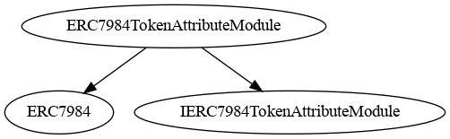
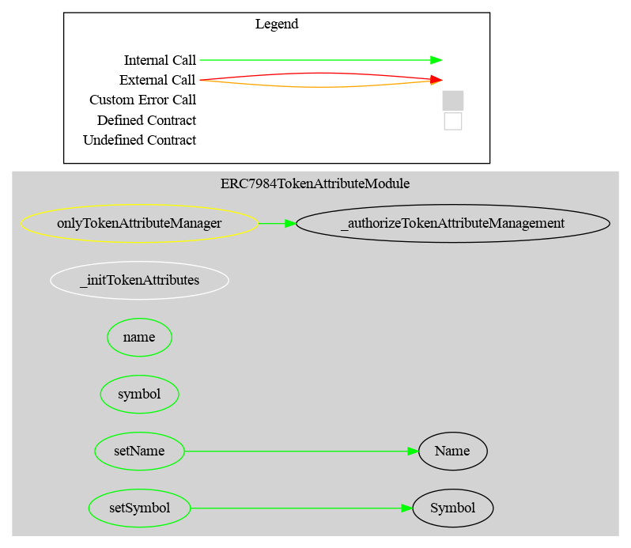

# ERC7984TokenAttributeModule — Technical Reference

## Overview

`ERC7984TokenAttributeModule` enables post-deployment updates to the token **name** and **symbol**, mirroring the behavior of CMTAT's `ERC20BaseModule` and the [ERC-3643 T-REX standard](../ERCSpecification/erc-3643-trex.md).

ERC-7984 (`ERC7984.sol`) stores name and symbol as `private` fields set once at construction. This module shadows them with its own storage and overrides `name()` / `symbol()`, enabling permissioned updates without redeployment.

**Source files:**
- Module: `contracts/modules/ERC7984TokenAttributeModule.sol`
- Interface: `contracts/interfaces/IERC7984TokenAttributeModule.sol`

**Availability:** All four deployment variants (`CMTATConfidential`, `CMTATConfidentialLite`, `CMTATConfidentialRuleEngine`, `CMTATConfidentialWhitelist`) — inherited through `CMTATConfidentialBase`.

---

## Diagrams

### Inheritance



### Call Graph



---

## Role

| Role | Constant | Gating hook |
|------|----------|-------------|
| `TOKEN_ATTRIBUTE_ROLE` | `keccak256("TOKEN_ATTRIBUTE_ROLE")` | `_authorizeTokenAttributeManagement()` |

Granted by `DEFAULT_ADMIN_ROLE`. Can be delegated to a compliance manager or token issuer without granting full admin rights.

---

## State

The module maintains two private string fields that shadow `ERC7984`'s own private name/symbol:

```
_name   (string) — current token name
_symbol (string) — current token symbol
```

These are seeded at construction via `_initTokenAttributes(name_, symbol_)` (called inside `CMTATConfidentialBase`'s constructor) and updated by `setName` / `setSymbol`.

---

## Functions

### `name() → string`

Returns the current token name from module storage.

Overrides `ERC7984.name()` so that updates via `setName` are reflected immediately in the public view.

### `symbol() → string`

Returns the current token symbol from module storage.

Overrides `ERC7984.symbol()` so that updates via `setSymbol` are reflected immediately in the public view.

### `setName(string calldata name_)`

Updates the token name.

- **Access control:** `TOKEN_ATTRIBUTE_ROLE`
- **Emits:** `Name(string indexed newNameIndexed, string newName)`

```solidity
await token.connect(admin).setName("Renamed Security Token");
```

### `setSymbol(string calldata symbol_)`

Updates the token symbol.

- **Access control:** `TOKEN_ATTRIBUTE_ROLE`
- **Emits:** `Symbol(string indexed newSymbolIndexed, string newSymbol)`

```solidity
await token.connect(admin).setSymbol("RST");
```

---

## Events

Both events mirror CMTAT's `ERC20BaseModule` event signatures exactly, ensuring compatibility with existing CMTAT tooling and indexers.

| Event | Signature | Emitted when |
|-------|-----------|--------------|
| `Name` | `Name(string indexed newNameIndexed, string newName)` | `setName()` completes |
| `Symbol` | `Symbol(string indexed newSymbolIndexed, string newSymbol)` | `setSymbol()` completes |

The indexed parameter is the `keccak256` hash of the new value (standard Solidity behavior for indexed strings). Off-chain indexers should listen for the unindexed `newName` / `newSymbol` parameter for the full string.

---

## Interface

`IERC7984TokenAttributeModule` extends `IERC3643ERC20Base` (from CMTAT's interface library) and adds the `Name` and `Symbol` events. This makes the module ABI-compatible with standard ERC-3643 tooling that expects `setName` / `setSymbol`.

```
IERC7984TokenAttributeModule
└── IERC3643ERC20Base
        ├── setName(string)
        └── setSymbol(string)
```

---

## Implementation Detail — Storage Shadowing

`ERC7984.name()` is declared `virtual`, so overriding it in the module is straightforward. However, ERC7984's underlying `_name` field is `private`, meaning the module cannot write to it directly. The module therefore maintains its own `private string _name` and `private string _symbol` fields and overrides `name()` / `symbol()` to read from those.

To ensure consistency from block 0, `CMTATConfidentialBase` calls `_initTokenAttributes(name_, symbol_)` immediately after the `ERC7984(name_, symbol_, contractUri_)` super call in its constructor:

```solidity
constructor(...) ERC7984(name_, symbol_, contractUri_) {
    _initTokenAttributes(name_, symbol_);   // seeds module storage
    ...
}
```

If `_initTokenAttributes` were omitted, `name()` and `symbol()` would return empty strings until `setName` / `setSymbol` were called.

---

## Diamond Resolution

`CMTATConfidential` inherits from both `CMTATConfidentialBase` (which overrides `name()`/`symbol()` via this module) and `ERC7984TotalSupplyViewModule` (which inherits `ERC7984.name()`/`ERC7984.symbol()` transitively). Solidity requires explicit disambiguation at each join point:

```solidity
// In CMTATConfidentialBase
function name() public view virtual override(ERC7984, ERC7984TokenAttributeModule) returns (string memory) {
    return ERC7984TokenAttributeModule.name();
}

// In CMTATConfidential
function name() public view virtual override(CMTATConfidentialBase, ERC7984) returns (string memory) {
    return CMTATConfidentialBase.name();
}
```

`CMTATConfidentialLite` (which does not inherit `ERC7984TotalSupplyViewModule`) does not need the second override.

---

## ERC-3643 Alignment

Standard CMTAT (`CMTATBaseCore`) gates `setName` / `setSymbol` with `DEFAULT_ADMIN_ROLE`. This module introduces a dedicated `TOKEN_ATTRIBUTE_ROLE` instead, consistent with the project's module pattern of one role per capability. The role can be granted to `DEFAULT_ADMIN_ROLE`'s holder or to a separate compliance manager.

| | CMTAT standard | CMTAT Confidential |
|--|---|---|
| Function names | `setName`, `setSymbol` | `setName`, `setSymbol` |
| Event names & signatures | `Name(string indexed, string)`, `Symbol(string indexed, string)` | identical |
| Controlling role | `DEFAULT_ADMIN_ROLE` | `TOKEN_ATTRIBUTE_ROLE` |

---

## Security Notes

- Renaming or retickling a live token can mislead off-chain price feeds, DEX aggregators, and other integrators that cache name/symbol at query time. Use with care and communicate changes in advance.
- `TOKEN_ATTRIBUTE_ROLE` is narrower than `DEFAULT_ADMIN_ROLE` and does not grant any other capability. It can safely be delegated to a communications or compliance team.
