# Operation Flows — How Mint, Burn and Transfer Work

## Table of Contents

- [Part 1 — In plain words](#part-1--in-plain-words)
  - [Terms used in this part](#terms-used-in-this-part)
  - [The sealed-envelope picture](#the-sealed-envelope-picture)
  - [Who does what](#who-does-what)
  - [Issuing tokens (mint)](#issuing-tokens-mint)
  - [Cancelling tokens (burn)](#cancelling-tokens-burn)
  - [Sending tokens (transfer)](#sending-tokens-transfer)
  - [What can stop an operation](#what-can-stop-an-operation)
  - [What stays private, what stays public](#what-stays-private-what-stays-public)
  - [Reading a balance](#reading-a-balance)
  - [Five things to remember](#five-things-to-remember)
- [Part 2 — Technical flows](#part-2--technical-flows)
  - [Common step: encrypting the amount](#common-step-encrypting-the-amount)
  - [Mint](#mint)
  - [Burn](#burn)
  - [Transfer](#transfer)
  - [Forced transfer and forced burn](#forced-transfer-and-forced-burn)
  - [Two freeze granularities in CMTAT, one here](#two-freeze-granularities-in-cmtat-one-here)
  - [Order of checks](#order-of-checks)
  - [ACL grants after each operation](#acl-grants-after-each-operation)
- [Part 3 — Horizontal diagrams for slides](#part-3--horizontal-diagrams-for-slides)
  - [Plain-language versions](#plain-language-versions)
  - [Technical versions](#technical-versions)
- [Source files](#source-files)

---

## Part 1 — In plain words

This part is written for readers who are not developers. It explains what happens when tokens are created, cancelled or sent, without going into code. The technical version follows in [Part 2](#part-2--technical-flows).

### Terms used in this part

The explanations below use everyday words instead of the technical vocabulary. This table gives, for each of them, what it stands for in the real system, so that a reader can move on to [Part 2](#part-2--technical-flows) or to the README [Glossary](../../README.md#glossary) without being lost.

| Plain word | What it means here | Technical term |
|---|---|---|
| **Register** | The list of who holds how many tokens, kept by the token contract on the blockchain. | Contract storage (`_balances`, `_totalSupply`) |
| **Token contract** | The program on the blockchain that keeps the register, checks the rules and applies the instructions it receives. Called "the token" for short. | `CMTATConfidential` smart contract |
| **Instruction** | A request sent to the token contract by a participant: issue, cancel, transfer, freeze… The blockchain either applies it entirely or rejects it entirely. | Transaction / function call |
| **Reverted** | The blockchain rejected the instruction: the register is left exactly as it was and the sender only pays the network fee. | Transaction revert (custom error such as `ERC7943CannotTransfer`) |
| **Sealed / sealing** | Encrypting an amount on the participant's own device before it leaves it. Once sealed, the amount is unreadable to anyone without a read permission — including the blockchain itself. | FHE encryption of the amount (`createEncryptedInput(...).encrypt()`) |
| **Sealed envelope** | An encrypted amount as it exists on the blockchain: a reference that everyone can see, whose content nobody can read without permission. Balances, amounts and the total supply are all envelopes. | Ciphertext handle (`euint64`) |
| **Proof that the envelope is well-formed** | A small certificate attached to a sealed envelope showing that the sender really knows the amount inside and that it is a valid number, without revealing it. It is tied to this token and this sender, so it cannot be reused elsewhere. | Zero-knowledge proof of knowledge (ZKPoK, `inputProof`) |
| **Sealed arithmetic** | Adding or subtracting envelopes without opening them. The result is a new sealed envelope. | Homomorphic operations (`FHE.add`, `FHE.sub`, `FHESafeMath`) |
| **New envelope** | Every sealed operation produces a fresh envelope for the result (new balance, amount moved). Read permissions must be given again on each new envelope. | New ciphertext handle after each `_update` |
| **Read permission / "the key"** | An entry written on the blockchain by the token contract saying that a given participant may ask the key managers to open a given envelope. It is not a cryptographic key, and it cannot be taken back once written. | FHE access-control list entry (`FHE.allow`) |
| **Authorised reader** | Anyone who holds a read permission on an envelope: the holder, an observer chosen by the holder, an observer appointed by the issuer. | ACL-authorised address, observer |
| **Opening an envelope** | Asking the key managers to decrypt an envelope. They check the read permission on the blockchain and return the amount to that reader only. Nothing is written on the blockchain. | User decryption through the relayer SDK and the KMS |
| **Key managers** | A group of independent parties that jointly hold the decryption keys; none of them holds the full key alone. | Zama Key Management Service (KMS, threshold MPC) |
| **Coprocessors** | Servers that carry out the sealed arithmetic the blockchain asked for. They never see the amounts either. | Zama FHEVM coprocessor network |
| **Public record** | The trace of an operation that everyone can see: who, to whom, when, and the reference of the envelope — never the amount. | Event (`ConfidentialTransfer`, `Mint`, `Burn`, …) |
| **Frozen** | An address the issuer has blocked **in full**: it can neither send nor receive, and cannot be issued to or cancelled from, until it is unfrozen. Only forced operations can move its tokens. Freezing part of a balance is not possible here (see [Two freeze granularities in CMTAT, one here](#two-freeze-granularities-in-cmtat-one-here)). | `setAddressFrozen` / `isFrozen` (`ENFORCER_ROLE`) |
| **Paused** | A temporary stop of all transfers between holders, decided by the issuer. Issuing and cancelling remain possible. | `pause` / `unpause` (`PAUSER_ROLE`) |
| **Deactivated** | The permanent end of the token: no more transfers, issues or cancellations. Cannot be undone. | `deactivateContract` (`DEFAULT_ADMIN_ROLE`) |
| **Allowlist** | A list of approved addresses; when it is switched on, every party to an operation must be on it. Only in the Whitelist variant. | `AllowlistModule` (`ALLOWLIST_ROLE`) |
| **Rule engine** | An external set of rules the issuer plugs into the token (sanctions list, blacklist, jurisdiction…) that can reject an operation based on the addresses involved. Only in the RuleEngine variant. | CMTA `RuleEngine` (`RULE_ENGINE_ROLE`) |
| **Broker** | A third party the holder has mandated, for a limited time, to transfer tokens on their behalf. | Operator (`setOperator`, `confidentialTransferFrom`) |
| **Observer** | A party (auditor, regulator, compliance officer, or the issuer itself) given read permission on an account's envelopes. | `setObserver` (by the holder) / `setRoleObserver` (`OBSERVER_ROLE`) |
| **Forced transfer / forced burn** | Moving or cancelling tokens of a frozen address without its consent, by a dedicated enforcement role, for court orders, sanctions or error correction. | `forcedTransfer` / `forcedBurn` (`FORCED_OPS_ROLE`) |
| **Publishing the total supply** | A decision by the issuer to make the current total-supply envelope readable by everyone. It applies to that envelope only; after the next issue or cancellation a new envelope exists. | `publishTotalSupply` (`SUPPLY_PUBLISHER_ROLE`) |

### The sealed-envelope picture

On a normal blockchain token, every balance and every amount is written in clear on a public ledger: anyone can open a block explorer and read how many tokens an address holds and how much it sent.

CMTAT Confidential keeps the same ledger, but every amount is placed in a **sealed envelope** before it reaches the ledger. The ledger records that an envelope moved from Alice to Bob; it does not show what is inside. The envelope can only be opened by the people who have been given a key: the holder, and whoever the holder or the issuer explicitly authorises.

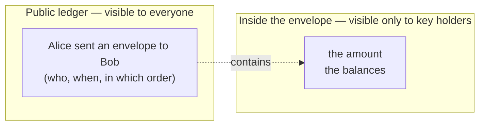

The remarkable part is that the ledger can still **do arithmetic on sealed envelopes**: it can subtract Alice's envelope from her balance and add it to Bob's balance without opening either. That is what *fully homomorphic encryption* (FHE) provides. The heavy computation is done by a network of specialised servers (the *coprocessors*), and the keys that can open an envelope are guarded by a group of independent parties (the *key management service*), so that no single company can peek inside.

**What "the key" means.** Nobody is handed a cryptographic key. The decryption keys never leave the key managers. What a participant receives is a **read permission**, recorded on the blockchain by the token contract itself, for one specific envelope: *"Alice may ask the key managers to open envelope #123"*. Every operation produces **new** envelopes (a new balance for the sender, a new balance for the recipient, and one for the amount that moved), and the token contract writes the read permissions for those new envelopes at the same time. In the diagrams below, "receives the key" always means "is granted read permission on that new envelope".

One word of vocabulary: in what follows, *the token* means the **token contract** — the program on the blockchain that keeps the register of holders. Nobody sends anything *to* it. Participants submit **instructions** to it (issue, cancel, transfer), each carrying a sealed envelope, and the program checks the rules and updates the register.

### Who does what

| Actor | Everyday equivalent | What they can do |
|---|---|---|
| **Issuer / administrator** | The company that issued the shares and its registrar | Appoints the roles below, can pause the token, freeze an address, order a forced transfer, and appoint auditors who may read balances |
| **Minter** | The registrar creating new share entries | Creates tokens for an investor |
| **Burner** | The registrar cancelling share entries | Cancels tokens held by an investor |
| **Holder** | The investor | Sends tokens, chooses who may read their balance |
| **Operator** | A broker or custodian mandated by the investor | Sends tokens on behalf of the holder, for a limited time |
| **Observer** | An auditor, a regulator, a compliance officer | Reads the balances they have been authorised to read |
| **Coprocessors and key managers** | The vault infrastructure | Compute on envelopes and open them only for authorised readers; they cannot act on the token themselves |

### Issuing tokens (mint)

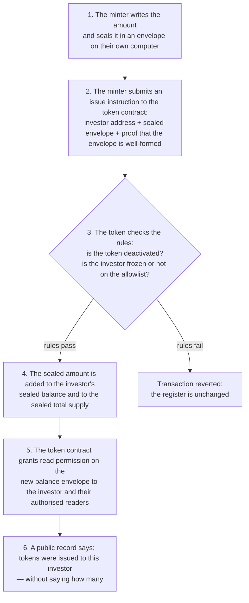

Points worth knowing:

- Issuing is still possible while the token is **paused** (pause only stops transfers between investors), but not once the token has been permanently **deactivated**.
- Issuing to a **frozen** address is reverted.
- The amount cannot exceed the technical ceiling of the token (about 18 billion billion base units). If it would, the token adds nothing rather than failing — see [Five things to remember](#five-things-to-remember).

### Cancelling tokens (burn)

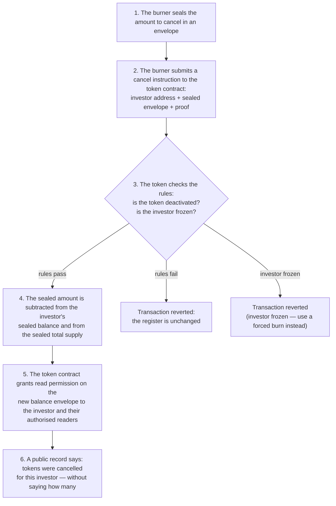

Points worth knowing:

- Only the issuer's burner can cancel tokens. An investor **cannot destroy their own tokens**, and a broker cannot do it for them.
- If the amount to cancel is larger than what the investor holds, the token cancels **nothing** — it does not cancel "as much as possible", and it does not raise an error. The burner should check the balance first (through an observer key) when the exact figure matters.
- To cancel tokens from a **frozen** investor (court order, sanctions), the issuer uses the *forced burn*, which is reserved to a dedicated role and requires the address to be frozen first. The issuer picks the amount and seals it like anyone else; freezing blocks the whole address, never part of a balance.

### Sending tokens (transfer)

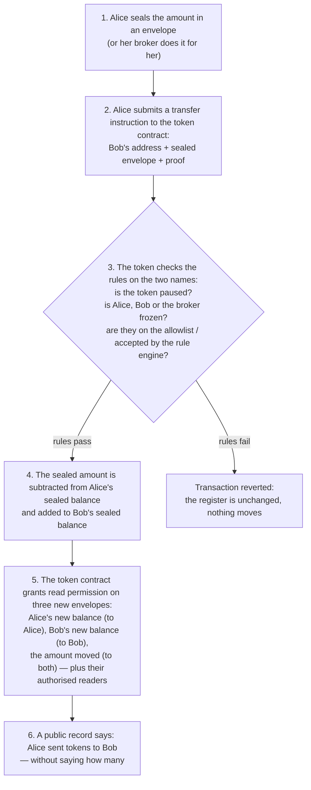

Points worth knowing:

- The rules are checked on the **names** (Alice, Bob, the broker), which are public — never on the amount. This is why all the usual compliance controls of CMTAT still work with sealed amounts.
- If Alice tries to send **more than she has**, the token moves **nothing** and does not raise an error. Her wallet will normally warn her before she sends, because her wallet can open her own envelope.
- Bob does not need to do anything to receive tokens, and Bob cannot refuse them.
- A broker (*operator*) must have been mandated by Alice beforehand, for a period she chooses. The broker is then subject to the same rules as Alice: if the broker is frozen or not allowlisted, the transfer is refused.

### What can stop an operation

| Situation | Issue (mint) | Cancel (burn) | Send (transfer) | Forced transfer / forced burn |
|---|:---:|:---:|:---:|:---:|
| Token **paused** by the issuer | allowed | allowed | **reverted** | allowed |
| Token permanently **deactivated** | **reverted** | **reverted** | **reverted** | allowed |
| The investor concerned is **frozen** | **reverted** | **reverted** | **reverted** | **required** |
| Investor not on the **allowlist** (Whitelist variant) | **reverted** | **reverted** | **reverted** | allowed |
| Rejected by the **rule engine** (RuleEngine variant) | **reverted** | **reverted** | **reverted** | allowed |
| Amount larger than the balance / ceiling | nothing moves | nothing moves | nothing moves | nothing moves |

"Reverted" means the blockchain rejects the whole transaction: the register is left exactly as it was, and the sender only pays the network fee.

The last row is the one that surprises newcomers: the token cannot "see" the amount, so it cannot revert an operation because of the amount. It executes the operation with a zero amount instead. The public record then shows a movement whose sealed amount is zero.

### What stays private, what stays public

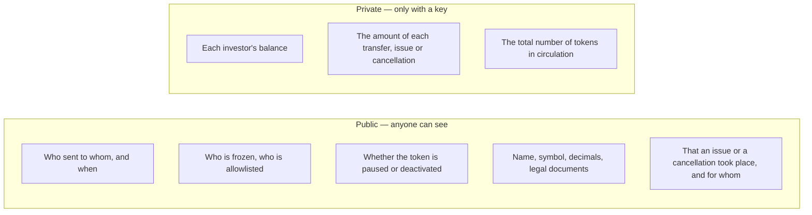

The issuer decides how far the privacy goes. It can appoint an **observer** on any account (for a regulator, an auditor, or itself), and it can **publish** the total supply when it wants the market to know it. Once a key has been given, it cannot be taken back for the envelopes already sealed — only for future ones.

### Reading a balance

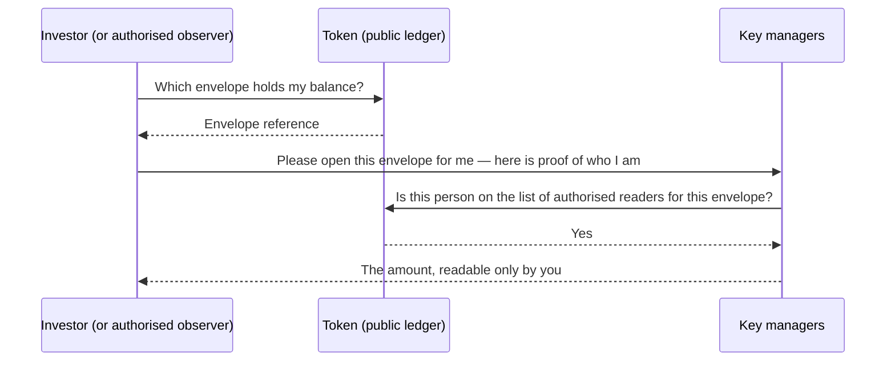

Nothing is written on the ledger when a balance is read. Someone who is **not** on the list of authorised readers is simply refused by the key managers.

### Five things to remember

1. **Names are public, amounts are private.** Compliance rules (pause, freeze, allowlist) work on names, so they work exactly as in a normal CMTAT token.
2. **Nobody can read an amount without a key** — not the issuer, not the blockchain operators — unless a key has been granted to them.
3. **Keys are given, never taken back.** Removing an observer stops future access, not access to what they could already read.
4. **An amount that is too large moves nothing, silently.** Wallets and back-offices must check balances before acting when the exact figure matters.
5. **The issuer keeps its enforcement powers**: pause, freeze, forced transfer and forced burn all work on sealed balances — the issuer just needs an observer key on the account if it wants to know the exact amount it is seizing.

---

## Part 2 — Technical flows

Every state-changing operation follows the same three stages:

1. the client encrypts the amount off-chain and obtains a zero-knowledge proof of knowledge (ZKPoK) for it;
2. the contract runs the CMTAT checks on **plaintext addresses**, then issues **symbolic FHE operations** on the encrypted amount and grants read access (FHE ACL) on the resulting handles;
3. the coprocessor network executes the queued FHE operations off-chain.

The contract never sees a plaintext amount. Any condition that depends on the amount (insufficient balance, `uint64` overflow) is resolved inside the ciphertext by `FHESafeMath` and results in a transfer of `0`, not a revert.

### Common step: encrypting the amount

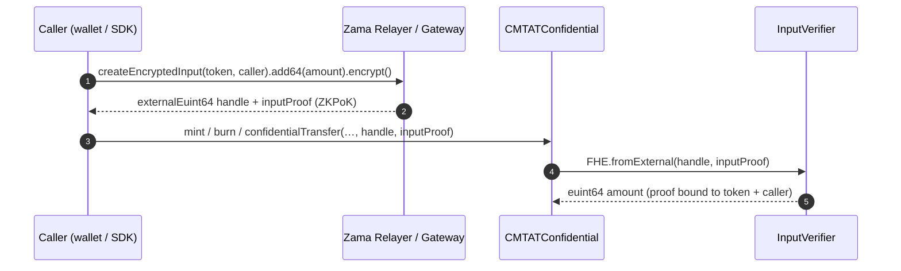

The `inputProof` binds the ciphertext to the token address and to the caller, so a proof produced for one contract or one sender cannot be replayed by another. The `euint64` overloads skip this step and require the caller to already hold ACL access on the handle (`FHE.isAllowed(amount, msg.sender)`).

### Mint

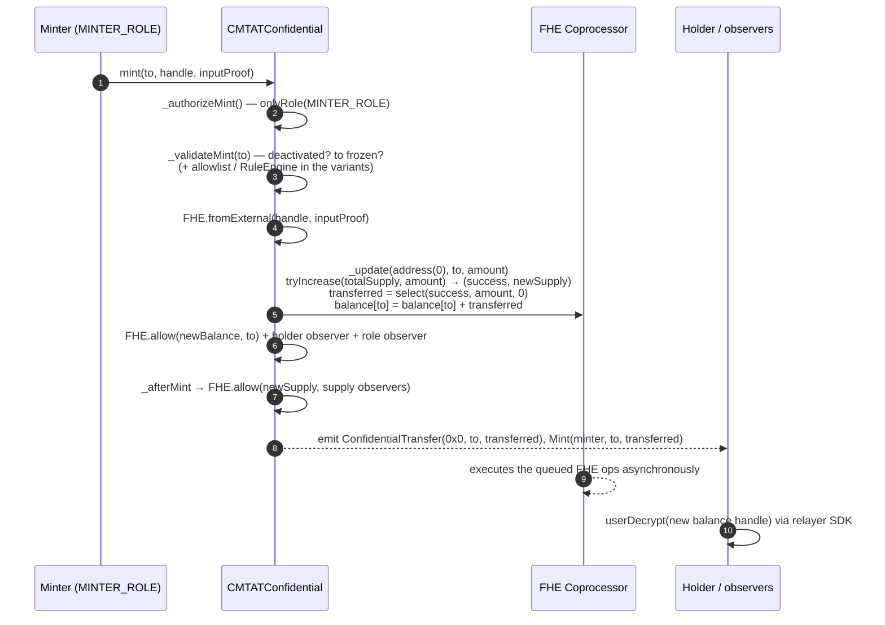

| Step | Where | Notes |
|---|---|---|
| Authorization | `ERC7984MintModule.onlyMinter` → `CMTATConfidentialBase._authorizeMint` | `MINTER_ROLE`; `DEFAULT_ADMIN_ROLE` implicitly holds it |
| Validation | `CMTATConfidentialBase._validateMint` → `ValidationModule._canMintBurnByModule(to)` | Reverts `ERC7943CannotReceive(to)` if deactivated or `to` frozen. Whitelist variant adds `isAllowlisted(to)`; RuleEngine variant adds `canTransferFrom(minter, address(0), to, 0)` then `transferred(...)` |
| Input | `FHE.fromExternal` | ZKPoK verified by `InputVerifier` |
| Arithmetic | `ERC7984._update(address(0), to, amount)` | `FHESafeMath.tryIncrease` on total supply guards `uint64` overflow; on failure `transferred = 0` |
| ACL | `ERC7984._update` → `ERC7984ObserverAccess._update` → `ERC7984BalanceViewModule._update` | New balance handle and `transferred` handle allowed to `to`, its holder observer and its role observer |
| Supply ACL | `CMTATConfidential._afterMint` → `_updateTotalSupplyObserversAcl` | Not in `CMTATConfidentialLite` |
| Events | `ConfidentialTransfer(0x0, to, transferred)`, `Mint(msg.sender, to, transferred)` | Handles only, no plaintext |

Minting is allowed while paused but not once deactivated.

### Burn

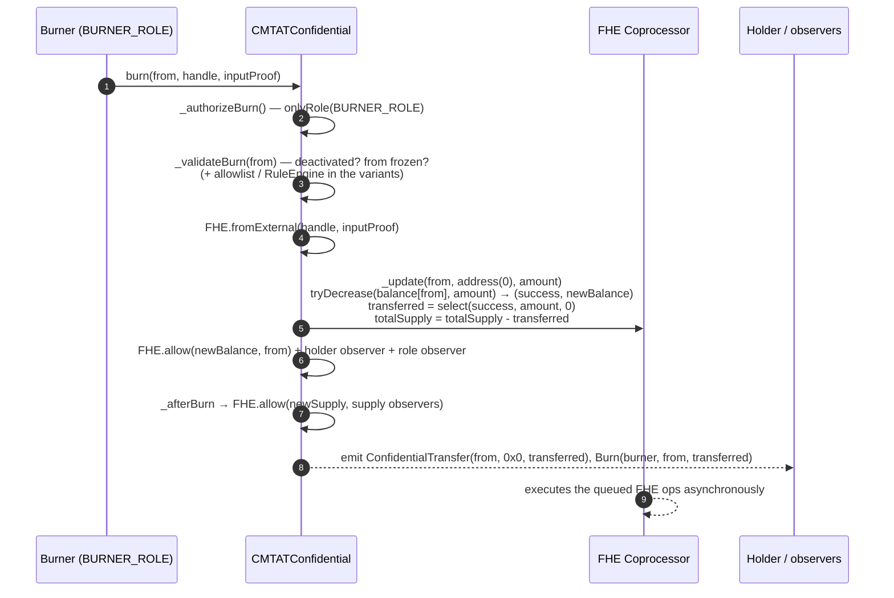

| Step | Where | Notes |
|---|---|---|
| Authorization | `ERC7984BurnModule.onlyBurner` → `_authorizeBurn` | `BURNER_ROLE` |
| Validation | `_validateBurn` → `_canMintBurnByModule(from)` | Reverts `ERC7943CannotSend(from)` if deactivated or `from` frozen; variants add allowlist / RuleEngine with the burner forwarded as `spender` |
| Arithmetic | `ERC7984._update(from, address(0), amount)` | `FHESafeMath.tryDecrease` on the balance; on insufficient balance `transferred = 0` and the supply is unchanged |
| ACL / supply ACL / events | as for mint | `Burn(msg.sender, from, transferred)` |

A frozen address cannot be burned from with `burn`; use `forcedBurn`.

### Transfer

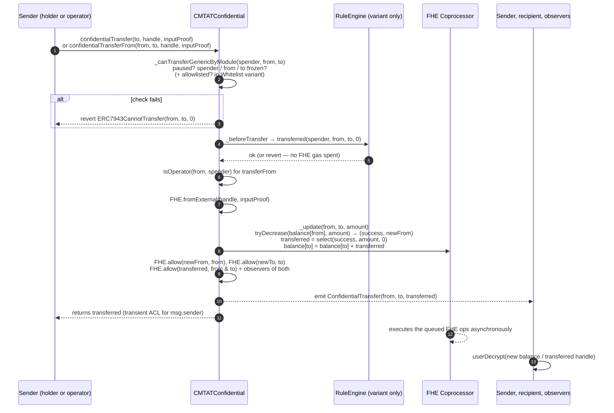

| Step | Where | Notes |
|---|---|---|
| Gate | `CMTATConfidentialBase.confidentialTransfer*` → `ValidationModule._canTransferGenericByModule(spender, from, to)` | `spender = address(0)` for direct transfers, `_msgSender()` for `transferFrom`. Checks pause, then `isFrozen` on spender, from and to. Whitelist variant: all three must be allowlisted. Revert `ERC7943CannotTransfer(from, to, 0)` |
| Hook | `_beforeTransfer(spender, from, to)` | Empty by default; RuleEngine variant calls `ruleEngine.transferred(...)` with `value = 0` |
| Operator | `ERC7984.confidentialTransferFrom` | `require(isOperator(from, msg.sender))` → `ERC7984UnauthorizedSpender` |
| Arithmetic | `ERC7984._transfer` → `_update(from, to, amount)` | `from` and `to` must be non-zero; `tryDecrease` then `add`; `transferred = 0` on insufficient balance |
| ACL | `_update` chain | Both balances and `transferred` allowed to both parties and their observers; `allowTransient(transferred, msg.sender)` for the caller |
| `AndCall` variants | `ERC7984._transferAndCall` | Recipient is credited first, then `onConfidentialTransferReceived` is called; a `false` return triggers a best-effort refund. Use only with trusted receivers (see README *Design Limitations*) |

All eight overloads (`confidentialTransfer`, `confidentialTransferFrom`, `…AndCall`, with proof or with handle) go through the same gate. The checks are ordered so that every plaintext rejection happens **before** any FHE operation is queued, which keeps a rejected transaction cheap and prevents the RuleEngine from being notified about a transfer that will not happen.

### Forced transfer and forced burn

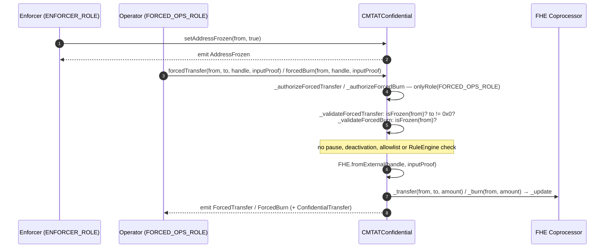

Forced operations are the **only** way to move tokens out of a frozen address, and they **only** work on a frozen address (`CMTAT_AddressNotFrozen`). `forcedTransfer` never burns (`to == address(0)` reverts with `CMTAT_Enforcement_ZeroAddressNotAllowed`). `FORCED_OPS_ROLE` (seize) and `ENFORCER_ROLE` (freeze) are distinct so that the two powers can be held by different actors.

**The seized amount is encrypted like any other.** `forcedTransfer` and `forcedBurn` take an `externalEuint64` with its proof, or an `euint64` handle the caller is allowed on; there is no plaintext-amount overload. The enforcer encrypts the amount on its own machine, bound to its own address, exactly as a minter or a holder does, so the value it seizes never appears in the calldata or in the event. What the enforcer *chooses* is therefore known to it, but what the account *holds* is not: an amount larger than the balance moves 0 without reverting. An enforcer that must seize an exact balance needs a read permission on the account first, through `setRoleObserver`.

### Two freeze granularities in CMTAT, one here

CMTAT Solidity offers two independent freeze mechanisms, and this implementation carries only the first:

| Mechanism | CMTAT Solidity | CMTAT Confidential |
|---|---|---|
| **Whole-address freeze** | `setAddressFrozen(account, freeze)`, `batchSetAddressFrozen`, `isFrozen` (`EnforcementModule`, `ENFORCER_ROLE`) | Present, inherited unchanged through `CMTATBaseGeneric` → `ValidationModule` → `EnforcementModule` |
| **Partial freeze (an amount)** | `freezePartialTokens(account, value)`, `unfreezePartialTokens`, `getFrozenTokens`, `getActiveBalanceOf` (`ERC20EnforcementModule`, `ERC20ENFORCER_ROLE`) | **Absent.** `ERC20EnforcementModule` is not inherited, and none of these functions or the role exist in `contracts/` |

The reason is the amount. A partial freeze means holding back part of a balance, so every transfer would have to compare the amount sent with the frozen quantity and refuse when it exceeds the free part. Both operands are `euint64`, so the comparison is encrypted: it yields an `ebool` that cannot drive a revert, and the best the token could do is silently transfer 0, which is indistinguishable from an insufficient balance and tells the holder nothing. The freeze granularity is therefore the whole address, and a partial seizure is expressed as `forcedTransfer` of the chosen amount rather than as a standing restriction.

### Order of checks

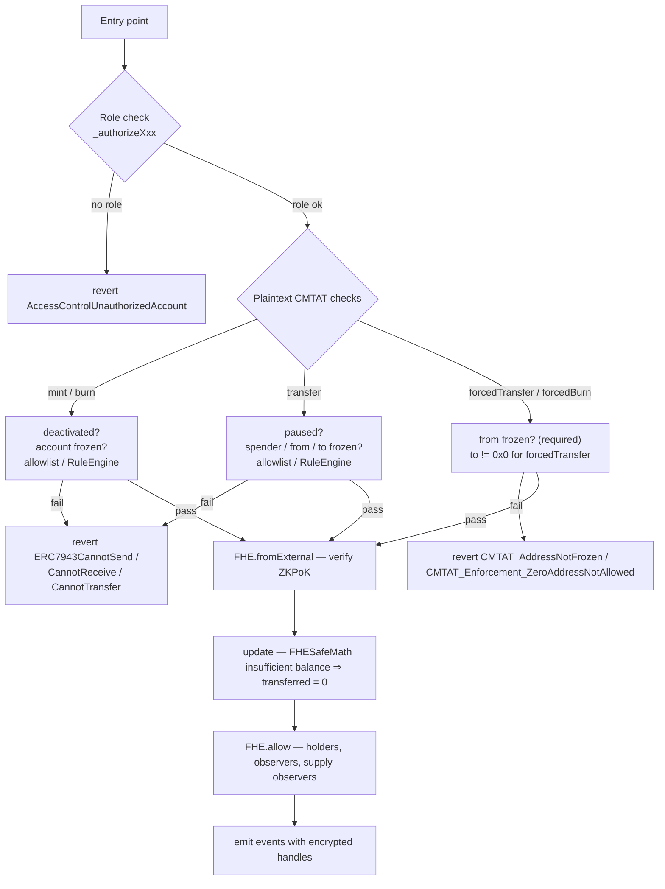

### ACL grants after each operation

Every FHE arithmetic operation produces a **new** ciphertext handle, so read access has to be re-granted after every update. The `_update` chain does this in three layers:

```
CMTATConfidentialBase._update
  └── ERC7984BalanceViewModule._update      → role observer of `from` and `to`
        └── ERC7984ObserverAccess._update   → holder-designated observer of `from` and `to`
              └── ERC7984._update           → `from`, `to`, the contract itself
```

| Handle | Granted to |
|---|---|
| new balance of `from` | `from`, its holder observer, its role observer, the contract |
| new balance of `to` | `to`, its holder observer, its role observer, the contract |
| `transferred` | `from`, `to`, both observers of each, the contract; transient grant to `msg.sender` |
| new total supply (mint / burn only) | the contract; every registered supply observer (`_afterMint` / `_afterBurn`, not in Lite) |

Grants are permanent: removing an observer stops future grants but does not revoke access to handles already granted.

---

## Part 3 — Horizontal diagrams for slides

Compact left-to-right versions of the flows above, one per slide. Labels are kept short so that they stay readable on a 16:9 slide; the vertical diagrams in Part 1 and Part 2 carry the details.

### Plain-language versions

#### The big picture

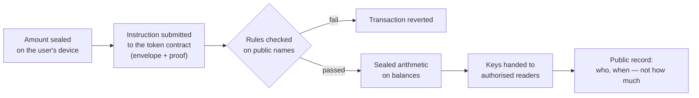

#### Issue tokens (mint)

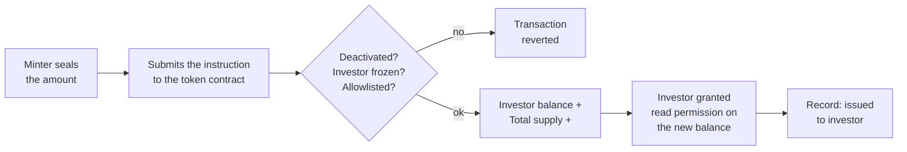

#### Cancel tokens (burn)

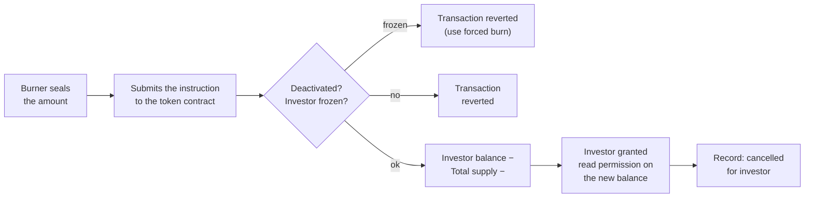

#### Send tokens (transfer)

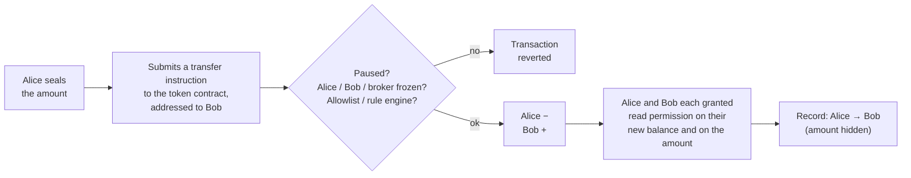

#### Enforcement (freeze, then seize)

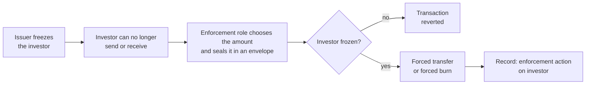

#### Reading a balance

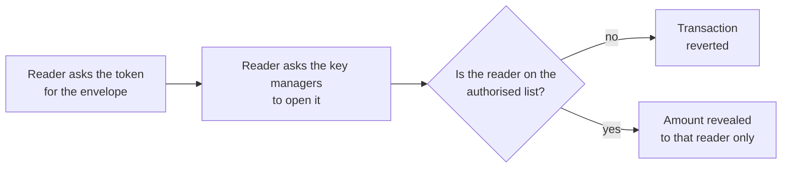

#### Who can see what

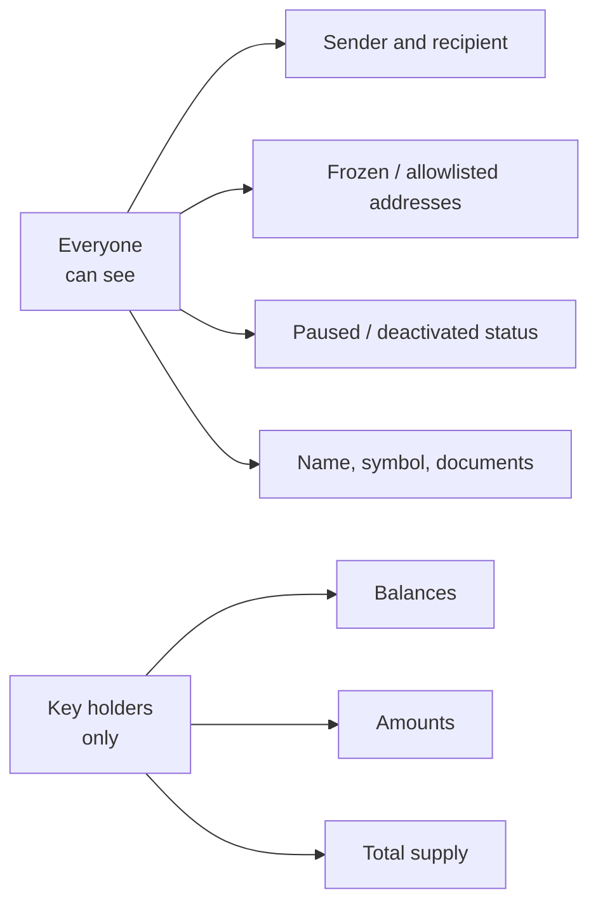

### Technical versions

#### Mint

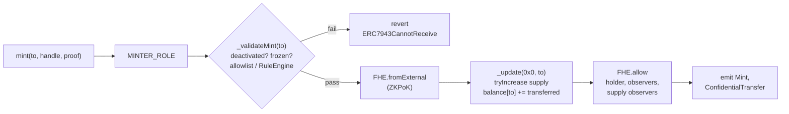

#### Burn

```mermaid
flowchart LR
    A["burn(from, handle, proof)"] --> B["BURNER_ROLE"]
    B --> C{"_validateBurn(from)<br/>deactivated? frozen?<br/>allowlist / RuleEngine"}
    C -- fail --> X["revert<br/>ERC7943CannotSend"]
    C -- pass --> D["FHE.fromExternal<br/>(ZKPoK)"]
    D --> E["_update(from, 0x0)<br/>tryDecrease balance<br/>supply −= transferred"]
    E --> F["FHE.allow<br/>holder, observers,<br/>supply observers"]
    F --> G["emit Burn,<br/>ConfidentialTransfer"]
```

#### Transfer

```mermaid
flowchart LR
    A["confidentialTransfer*<br/>(8 overloads)"] --> B{"_canTransferGenericByModule<br/>paused? frozen?<br/>allowlist"}
    B -- fail --> X["revert<br/>ERC7943CannotTransfer"]
    B -- pass --> C["_beforeTransfer<br/>RuleEngine.transferred<br/>(value = 0)"]
    C --> D["isOperator<br/>(transferFrom only)"]
    D --> E["FHE.fromExternal<br/>(ZKPoK)"]
    E --> F["_update(from, to)<br/>tryDecrease / add<br/>select(success, amount, 0)"]
    F --> G["FHE.allow<br/>both parties,<br/>their observers"]
    G --> H["emit<br/>ConfidentialTransfer"]
```

#### Forced transfer / forced burn

```mermaid
flowchart LR
    A["setAddressFrozen(from, true)<br/>ENFORCER_ROLE"] --> B["forcedTransfer / forcedBurn<br/>FORCED_OPS_ROLE"]
    B --> C{"isFrozen(from)?<br/>to != 0x0?"}
    C -- fail --> X["revert<br/>CMTAT_AddressNotFrozen"]
    C -- pass --> D["FHE.fromExternal<br/>(ZKPoK)"]
    D --> E["_update<br/>no pause / allowlist /<br/>RuleEngine check"]
    E --> F["FHE.allow<br/>parties, observers"]
    F --> G["emit ForcedTransfer /<br/>ForcedBurn"]
```

#### Three stages of every operation

```mermaid
flowchart LR
    subgraph S1["1. Off-chain — client"]
        A["encrypt amount"] --> B["ZKPoK proof"]
    end
    subgraph S2["2. On-chain — contract"]
        C["role + CMTAT checks<br/>on plaintext addresses"] --> D["symbolic FHE ops<br/>on the ciphertext"] --> E["ACL grants<br/>+ events"]
    end
    subgraph S3["3. Off-chain — Zama"]
        F["coprocessors execute<br/>the FHE ops"] --> G["KMS decrypts for<br/>authorised readers"]
    end
    B --> C
    E --> F
```

#### ACL re-grant chain

```mermaid
flowchart LR
    A["CMTATConfidentialBase<br/>_update"] --> B["ERC7984BalanceViewModule<br/>role observers"]
    B --> C["ERC7984ObserverAccess<br/>holder observers"]
    C --> D["ERC7984<br/>from, to, contract"]
    D --> E["_afterMint / _afterBurn<br/>supply observers<br/>(not Lite)"]
```

---

## Source files

| Concern | File |
|---|---|
| Transfer overrides, validation hooks, `_beforeTransfer`, `_update` diamond | `contracts/CMTATConfidentialBase.sol` |
| Mint | `contracts/modules/ERC7984MintModule.sol` |
| Burn | `contracts/modules/ERC7984BurnModule.sol` |
| Forced transfer / forced burn | `contracts/modules/ERC7984EnforcementModule.sol` |
| Observer ACL re-grants | `contracts/modules/ERC7984BalanceViewModule.sol`, `contracts/modules/ERC7984TotalSupplyViewModule.sol` |
| RuleEngine hook | `contracts/modules/ERC7984RuleEngineModule.sol`, `contracts/deployment/CMTATConfidentialRuleEngine.sol` |
| Allowlist hook | `contracts/deployment/CMTATConfidentialWhitelist.sol` |
| Plaintext CMTAT checks | `lib/CMTAT/contracts/modules/wrapper/controllers/ValidationModule.sol` |
| ERC-7984 arithmetic and base ACL | `lib/openzeppelin-confidential-contracts/contracts/token/ERC7984/ERC7984.sol` |
